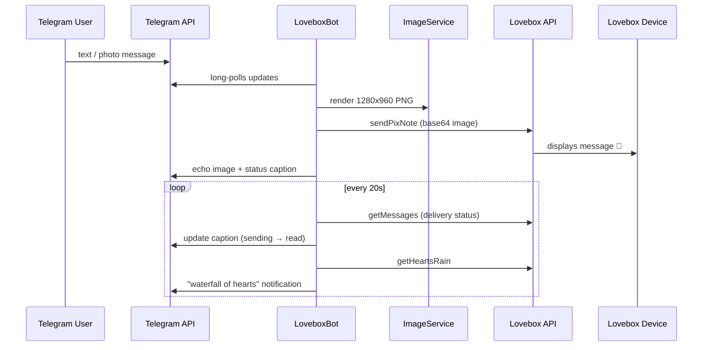

# Lovebox Telegram Sender

[](https://github.com/patbaumgartner/lovebox-telegram-sender/actions/workflows/ci.yml)
[](https://github.com/patbaumgartner/lovebox-telegram-sender/actions/workflows/release.yml)
[](https://github.com/patbaumgartner/lovebox-telegram-sender/actions/workflows/codeql.yml)
[](https://github.com/patbaumgartner/lovebox-telegram-sender/actions/workflows/dependency-review.yml)
[](LICENSE)
[](https://hub.docker.com/r/patbaumgartner/lovebox-telegram-sender)

Send messages to a [Lovebox](https://lovebox.love) straight from Telegram. 💌

A Telegram bot receives your **text messages** and **captioned photos**, renders them as
images sized for the Lovebox display, and delivers them through the (undocumented)
Lovebox mobile-app API. Delivery status updates (e.g. *sending* → *read*) are reflected
back into the Telegram chat, and when your loved one spins the heart on the box, the bot
announces the "waterfall of hearts" in the chat. Any other message type is answered with
a friendly default image.

Built with **Spring Boot 4** and compiled to a **GraalVM native image** — it idles at a
few dozen MB of RAM, which makes it a perfect fit for a small home server or NAS
(it runs in production on a Synology DS918+ with an Intel J3455).

## How It Works



## Quick Start (Docker)

1. Create a `.env` file with your configuration (see
   [Configuration](#configuration) and [Obtaining your Lovebox IDs](#obtaining-your-lovebox-ids)):

   ```bash
   # Lovebox account
   LOVEBOX_ENABLED=true
   LOVEBOX_EMAIL="me@email.com"
   LOVEBOX_PASSWORD="mySecret"
   # Lovebox device & box
   LOVEBOX_SIGNATURE="Signature"
   LOVEBOX_DEVICE_ID="42fab8322d8cec91"
   LOVEBOX_BOX_ID="417a114e58e15a0214cf3612"
   # Telegram bot
   BOT_USERNAME="Lovebox_bot"
   BOT_TOKEN="123456:ABC-DEF1234ghIkl-zyx57W2v1u123ew11"
   ```

2. Start the container with the bundled [docker-compose.yml](docker-compose.yml):

   ```bash
   docker compose up -d
   ```

3. Open a chat with your bot on Telegram and send it a message. ❤️

> [!NOTE]
> The published image is a GraalVM **native image built for x86-64-v2** (e.g. Intel
> J3455 and newer). For other architectures, build the image yourself — see
> [Building](#building).

### Synology NAS

On DSM, use **Container Manager → Project → Create**, point it at a folder containing
the `docker-compose.yml` and your `.env` file, and start the project. The compose file
sets `restart: unless-stopped`, a memory limit, log rotation, and the `TZ` timezone used
for the delivery timestamps shown in Telegram captions.

## Configuration

All settings live in [application.properties](src/main/resources/application.properties)
and can be overridden via environment variables (Spring Boot relaxed binding), Java
system properties, or command-line arguments.

| Property            | Environment variable | Description                                                    | Default                           |
| ------------------- | -------------------- | -------------------------------------------------------------- | --------------------------------- |
| `lovebox.enabled`   | `LOVEBOX_ENABLED`    | Master switch; `false` = dry-run without any Lovebox API calls | `true`                            |
| `lovebox.email`     | `LOVEBOX_EMAIL`      | Lovebox account e-mail                                         | –                                 |
| `lovebox.password`  | `LOVEBOX_PASSWORD`   | Lovebox account password                                       | –                                 |
| `lovebox.device-id` | `LOVEBOX_DEVICE_ID`  | Device ID registered with your account                         | –                                 |
| `lovebox.box-id`    | `LOVEBOX_BOX_ID`     | The Lovebox to send messages to                                | –                                 |
| `lovebox.signature` | `LOVEBOX_SIGNATURE`  | Sender signature shown on the box                              | –                                 |
| `lovebox.api-url`   | `LOVEBOX_API_URL`    | Lovebox API base URL                                           | `https://app-api.loveboxlove.com` |
| `bot.username`      | `BOT_USERNAME`       | Telegram bot username (informational)                          | –                                 |
| `bot.token`         | `BOT_TOKEN`          | Telegram bot API token from `@BotFather`                       | –                                 |

For local development, put your secrets into
`src/main/resources/application-local.properties` (gitignored) and run with the `local`
profile:

```bash
./mvnw spring-boot:run -Dspring-boot.run.profiles=local
```

### Setting up a Telegram Bot

Contact [@BotFather](https://telegram.me/BotFather) on Telegram and use the `/newbot`
command. Follow the instructions and note the bot `username` and `token`.

## Obtaining your Lovebox IDs

The `device-id` and `box-id` come from the Lovebox API of an existing account (set up
the account with the Android/iOS app first).

### 1. Login with Password

Log in to retrieve the authorization token for the next request:

```bash
curl --request POST 'https://app-api.loveboxlove.com/v1/auth/loginWithPassword' \
--header 'content-type: application/json' \
--data-raw '{
    "email": "my@email.com",
    "password": "mySecret"
}'
```

```json
{
  "_id": "42c61f261f399d0016350b7f",
  "firstName": "FirstName",
  "email": "my@email.com",
  "token": "eyJhbGciOi...<JWT token>"
}
```

### 2. Me Request with the Authorization Token

Use the token to query your profile, which contains the values you need:

```bash
curl --request POST 'https://app-api.loveboxlove.com/v1/graphql' \
--header 'authorization: Bearer eyJhbGciOi...<JWT token>' \
--header 'content-type: application/json' \
--data-raw '{
    "operationName": null,
    "variables": {},
    "query": "{ me { _id firstName email boxes { _id signature nickname __typename } device { _id appVersion os __typename } __typename } }"
}'
```

```jsonc
{
  "data": {
    "me": {
      "_id": "42c61f261f399d0016350b7f",
      "firstName": "FirstName",
      "email": "me@email.com",
      "boxes": [
        {
          "_id": "417a114e58e15a0214cf3612",   // → lovebox.box-id
          "signature": "Signature",            // → lovebox.signature
          "nickname": "Nickname",
          "__typename": "BoxSettings"
        }
      ],
      "device": {
        "_id": "42fab8322d8cec91",             // → lovebox.device-id
        "appVersion": "5.14.9",
        "os": "android",
        "__typename": "Device"
      },
      "__typename": "User"
    }
  }
}
```

## Building

### Prerequisites

- **JDK 25** (see [.sdkmanrc](.sdkmanrc); `sdk env install` sets it up with [SDKMAN!](https://sdkman.io))
- **Docker** for container / native buildpack builds
- A **GraalVM / Liberica NIK** toolchain only if you compile a native binary locally

### JVM Build & Tests

```bash
./mvnw verify
```

### Docker Image (JVM)

The image name, custom run image, pull policy, and buildpack environment are baked into
the `spring-boot-maven-plugin` configuration in [pom.xml](pom.xml):

```bash
./mvnw spring-boot:build-image
```

### Docker Image (GraalVM Native)

The `native` Maven profile (extending the one inherited from
`spring-boot-starter-parent`) adds the AWT/charset build arguments the application needs
for image rendering, and targets the **x86-64-v2** CPU baseline (Intel J3455 and newer):

```bash
# Build the custom run image with fonts first (see "Fonts in Containers" below)
docker build -t patbaumgartner/lovebox-telegram-sender-run:latest -f Dockerfile.base-cnb .

./mvnw -Pnative spring-boot:build-image
```

To compile only a native binary (no container):

```bash
./mvnw -Pnative native:compile
```

> [!NOTE]
> Native compilation requires a GraalVM/Liberica NIK toolchain (local builds) or Docker
> (buildpack path) and takes noticeably longer than a regular JVM build.

### Fonts in Containers

The application renders text with `java.awt`, which requires `fontconfig`, `libfreetype`
and at least one installed font at runtime — otherwise the JVM/native binary fails with
`NullPointerException: Cannot load from short array because sun.awt.FontConfiguration.head is null`.
[Andreas Ahlensdorf](https://github.com/aahlenst) describes the problem in
[Prerequisites for Font Support in AdoptOpenJDK](https://blog.adoptopenjdk.net/2021/01/prerequisites-for-font-support-in-adoptopenjdk/).

Since buildpack run images cannot be extended at build time, the `<runImage>` in
[pom.xml](pom.xml) points to a custom run image built from
[Dockerfile.base-cnb](Dockerfile.base-cnb), which adds `fontconfig` and the Noto Emoji
font (for emoji support 🚀) on top of the Paketo Ubuntu Noble run image.

## Native Image Notes

GraalVM native images are ahead-of-time compiled: everything reached via reflection,
JNI, or resource loading must be registered at build time. This project encapsulates the
required hints and workarounds — all documented in the sources:

| Concern | Where | Why |
| ------- | ----- | --- |
| Telegram Bot API reflection | `TelegramBotsRuntimeHints` | telegrambots ships no GraalVM metadata; Jackson needs reflective access |
| JPEG decoding via JNI | `TelegramBotsRuntimeHints` | `JPEGImageReader` resolves fields through JNI at runtime |
| Lovebox DTO (de)serialization | `NativeHintsConfiguration` | HTTP interface records are bound by Jackson |
| Bundled fallback image | `ApplicationRuntimeHints` | `lovebox.jpeg` must be included as a native resource |
| Bot registration | `TelegramBotsConfiguration` / `TelegramBotsRegistrar` | the starter's `ObjectProvider` injection and lambda event listeners silently fail under AOT |
| Keep-alive | `application.properties` | native polling threads are daemons; without keep-alive the process exits after startup |

## Project Layout

```text
src/main/java/com/patbaumgartner/lovebox/telegram/sender/
├── LoveboxTelegramSenderApplication.java  # Spring Boot entry point
├── config/      # GraalVM native-image hints
├── image/       # ImageService: renders 1280x960 PNGs (photos, text, fallback)
├── lovebox/     # Lovebox API client, DTOs, service, startup verification
└── telegram/    # LoveboxBot, bot configuration, long-polling registration
```

## Troubleshooting

| Symptom | Cause / Fix |
| ------- | ----------- |
| `sun.awt.FontConfiguration.head is null` | Run image lacks fonts — use the custom run image from `Dockerfile.base-cnb` |
| Bot starts but ignores messages | Check `lovebox.enabled` and the bot token; see also the native-image notes above |
| `Lovebox account ... does not exist` in logs | Wrong `lovebox.email` / `lovebox.password` |
| Photo messages fail, text works (native) | Missing JNI hints for the JPEG decoder — fixed by `TelegramBotsRuntimeHints` |
| Wrong timestamps in captions | Set the `TZ` environment variable (see `docker-compose.yml`) |

## Contributing

Contributions are welcome! Please read [CONTRIBUTING.md](CONTRIBUTING.md) for the
development workflow, coding conventions, and how to run the test suite.

## License

Licensed under the [Apache License, Version 2.0](LICENSE).

## Disclaimer

This project is not affiliated with, endorsed by, or connected to Lovebox SAS. It uses
the undocumented API of the official mobile app, which may change or break at any time.
